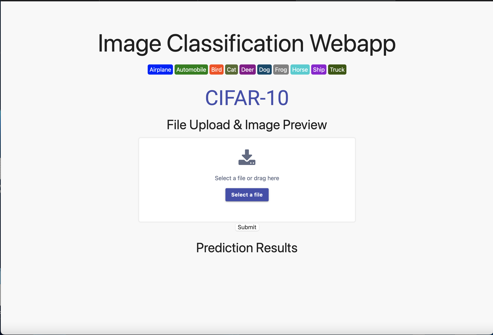
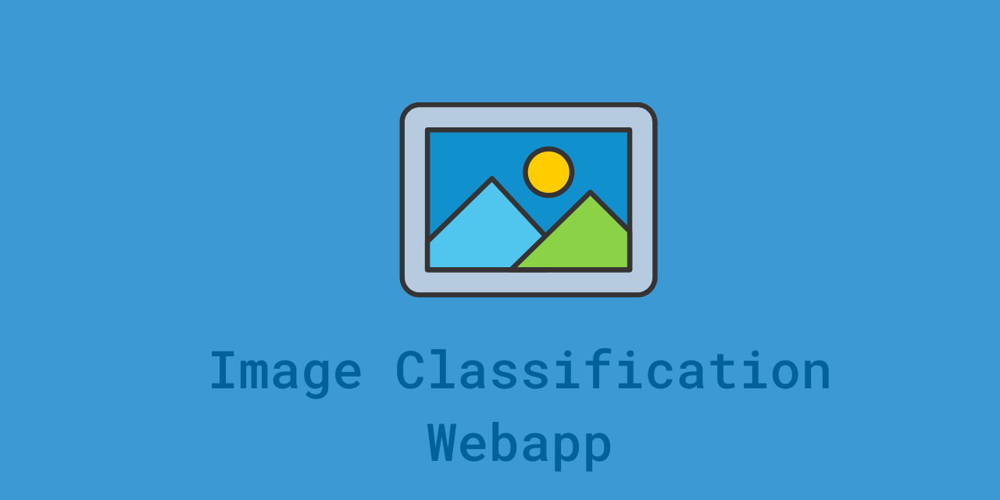
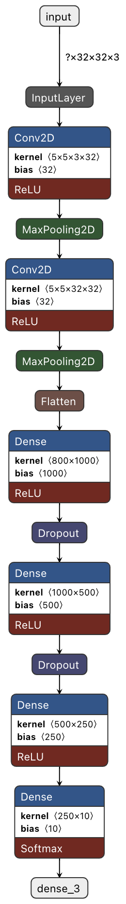

# Image Classification Webapp

## Overview

**Type:** AI / Machine Learning Web App  
**Status:** Completed  
**GitHub:** https://github.com/pan-k15/image-classification-web

Image Classification Webapp is an AI-powered web project that classifies uploaded images and returns the predicted category as text. The app uses a deep learning model trained with the CIFAR-10 dataset and provides a simple Flask-based interface for uploading an image and viewing the result.

## Details

| Field | Information |
| --- | --- |
| Project name | Image Classification Webapp |
| Project type | AI / Machine Learning Web App |
| Main technology | Python, Flask, HTML, CSS, Bootstrap |
| Machine learning | Deep learning image classifier trained with CIFAR-10 |
| Role | Developer |
| Repository | https://github.com/pan-k15/image-classification-web |

## Description

This project demonstrates how a trained image classification model can be deployed inside a web application. Users upload an image through the browser, the Flask backend processes it with the trained model, and the app displays the predicted image category as text.

The project is useful as a compact example of combining machine learning with a web interface. It covers the full flow from model usage to user-facing prediction output.

## Images

## Features

- Upload an image through a web interface
- Classify the uploaded image using a deep learning model
- Return the predicted class as readable text
- Flask backend for serving the app and handling prediction
- Simple frontend built with HTML, CSS, and Bootstrap

## Links

- **GitHub:** https://github.com/pan-k15/image-classification-web

## Notes

The project uses the CIFAR-10 dataset, a common dataset for image classification tasks. The repository includes the trained model file, Flask application code, frontend templates, static assets, and preview images.
