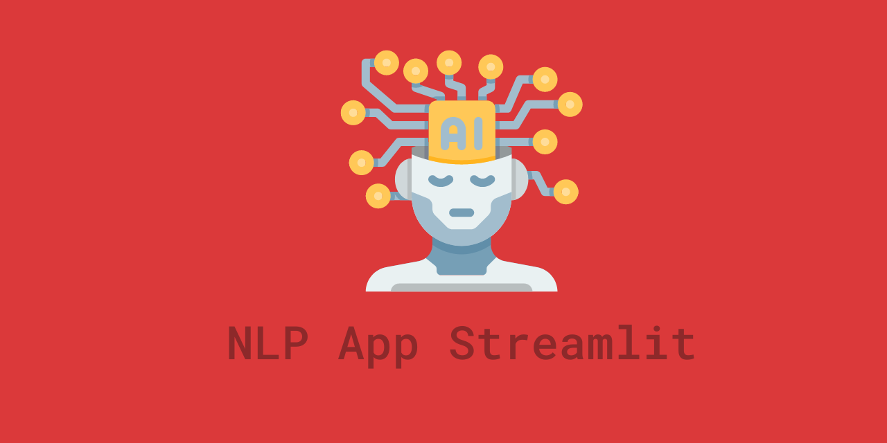

# NLP Web App — Streamlit

## Overview

**Type:** NLP / Machine Learning Web App  
**Status:** Completed  
**GitHub:** https://github.com/pan-k15/nlp-app-streamlit

NLP Web App is an all-in-one Natural Language Processing application built with Streamlit. It combines classical NLP tools such as NLTK and spaCy with modern Transformer-based models from HuggingFace in a single interactive web interface.

## Details

| Field | Information |
| --- | --- |
| Project name | NLP Web App — Streamlit |
| Project type | NLP / Machine Learning Web App |
| Main technology | Python, Streamlit, NLTK, spaCy, HuggingFace Transformers, PyTorch |
| Visualization | spaCy-Streamlit, annotated-text |
| Target runtime | Python 3.8+ |
| Repository | https://github.com/pan-k15/nlp-app-streamlit |

## Description

This project provides a Streamlit interface for experimenting with multiple NLP workflows in one place. Users can paste a passage or story, then run tasks such as question answering, text summarization, sentiment analysis, word segmentation, sentence segmentation, named entity recognition, part-of-speech tagging, and tokenizer inspection.

The app is useful as a practical NLP playground because it brings together both traditional NLP processing and Transformer-based deep learning models. It also demonstrates how Streamlit can be used to build an accessible interface for machine learning tools without requiring a complex frontend.

## Images

Recommended screenshots to add:

- `./images/home-screen.png` - Main Streamlit app screen
- `./images/question-answering.png` - Question answering result
- `./images/ner-visualization.png` - Named entity visualization
- `./images/summarization.png` - Text summarization result

## Features

- Question answering against a provided passage
- Text summarization for long-form input
- Sentiment analysis with a Transformer model
- Word segmentation using NLTK and spaCy
- Sentence segmentation using NLTK
- Named entity recognition with spaCy
- Part-of-speech tagging with NLTK
- Interactive NER visualization in the browser
- DistilBERT tokenizer demo with output tensors

## Models And Tools

| Feature | Backend |
| --- | --- |
| Question answering | `deepset/roberta-base-squad2` |
| Text summarization | `facebook/bart-large-cnn` |
| Sentiment analysis | `siebert/sentiment-roberta-large-english` |
| DistilBERT tokenizer | `distilbert-base-uncased` |
| NER tagging | spaCy |
| POS tagging | NLTK |
| Visualization | spaCy-Streamlit, annotated-text |

## Links

- **GitHub:** https://github.com/pan-k15/nlp-app-streamlit
- **Streamlit:** https://streamlit.io/
- **HuggingFace Transformers:** https://huggingface.co/docs/transformers/
- **spaCy:** https://spacy.io/
- **NLTK:** https://www.nltk.org/

## Notes

The app downloads HuggingFace models on first run, so the first startup may take longer and requires a stable internet connection. The project is designed for Python 3.8+ and can be started with `streamlit run app.py`.
