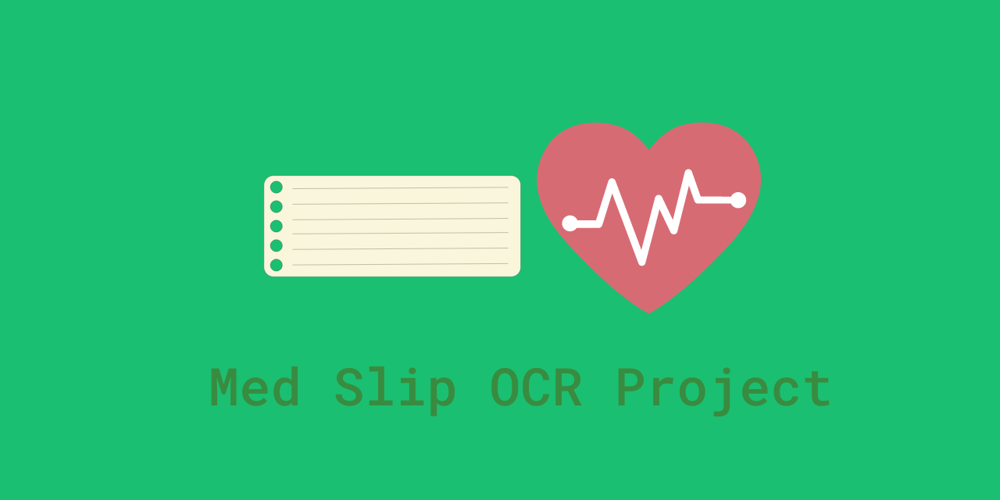
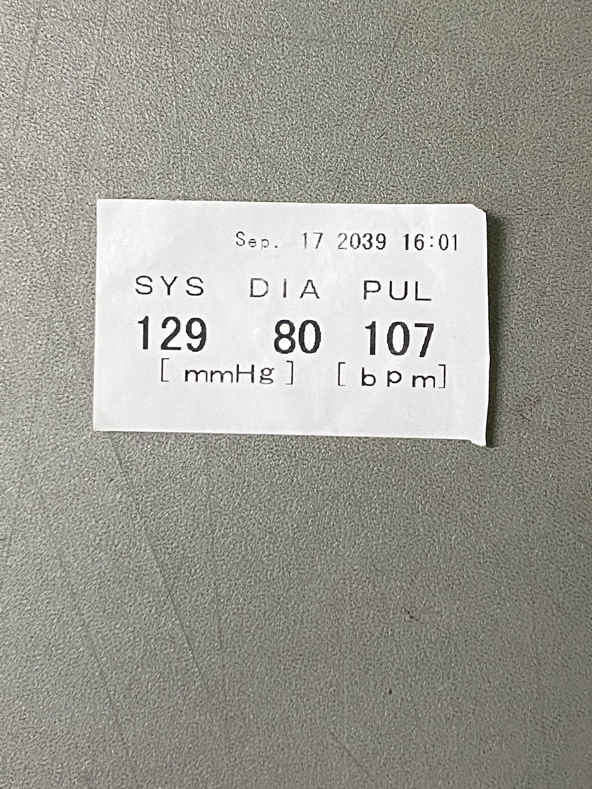
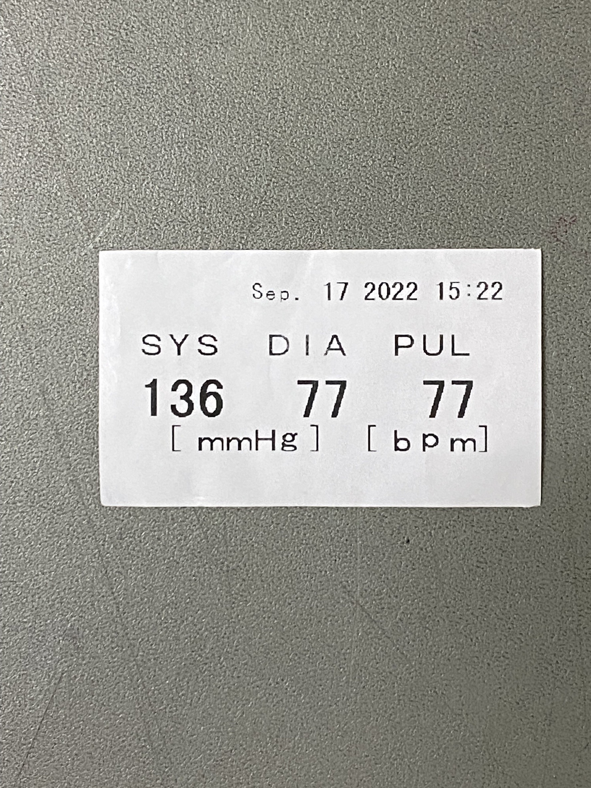
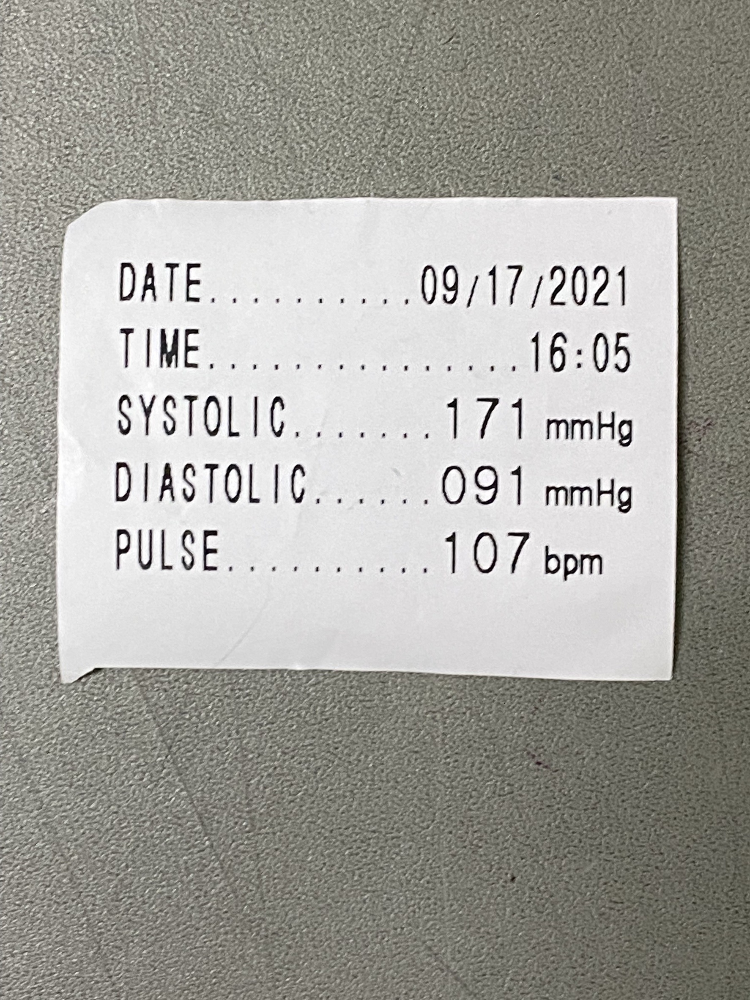
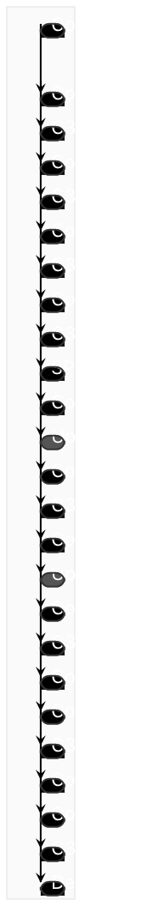

# Med Slip OCR Project

## Overview

**Type:** OCR / Computer Vision Web App  
**Status:** Completed  
**GitHub:** https://github.com/pan-k15/med-slip-ocr

Med Slip OCR is an AI-powered project for reading numbers from medical slips. It uses object detection and OCR to detect important text regions, crop them from uploaded medical slip images, and extract readings such as date, time, systolic pressure, diastolic pressure, and pulse.

## Details

| Field | Information |
| --- | --- |
| Project name | Med Slip OCR Project |
| Project type | OCR / Computer Vision Web App |
| Main technology | Python, Streamlit, PyTorch, YOLO, EasyOCR, OpenCV, Pandas |
| Detection model | Custom YOLO model |
| OCR engine | EasyOCR |
| Repository | https://github.com/pan-k15/med-slip-ocr |

## Description

This project was created during the Super AI Engineer Internship at Botnoi. The goal is to reduce manual data entry from medical slips by automatically detecting and reading key values from slip images.

The workflow starts with one or more uploaded slip images. A YOLO detection model identifies text regions, crops the detected parts, and passes them to EasyOCR. The extracted values are then organized into structured data that can be exported for later use.

## Images

Recommended screenshots to add:

- `./images/dashboard.png` - Streamlit dashboard screen
- `./images/upload-flow.png` - Image upload workflow
- `./images/ocr-result.png` - OCR result table or output

## Features

- Upload multiple medical slip images
- Detect important text regions in each image
- Crop detected regions automatically
- Read text from cropped regions using EasyOCR
- Extract medical reading values such as date, time, SYS, DIA, and PUL
- Save extracted OCR results into structured CSV data
- Provide a user-friendly Streamlit interface

## Workflow

| Step | Description |
| --- | --- |
| 1 | Upload one or more medical slip images |
| 2 | Run YOLO object detection to locate target text areas |
| 3 | Crop detected regions from the image |
| 4 | Run EasyOCR on cropped regions |
| 5 | Organize extracted readings into structured data |
| 6 | Export results to CSV |

## Links

- **GitHub:** https://github.com/pan-k15/med-slip-ocr
- **Streamlit:** https://streamlit.io/
- **PyTorch:** https://pytorch.org/
- **EasyOCR:** https://github.com/JaidedAI/EasyOCR
- **YOLO:** https://github.com/ultralytics/yolov5

## Notes

The repository includes a trained model file, sample slip images, Streamlit app code, detection modules, OCR modules, and data-management modules. It combines object detection and OCR so the system can focus recognition on the most important parts of each medical slip.
